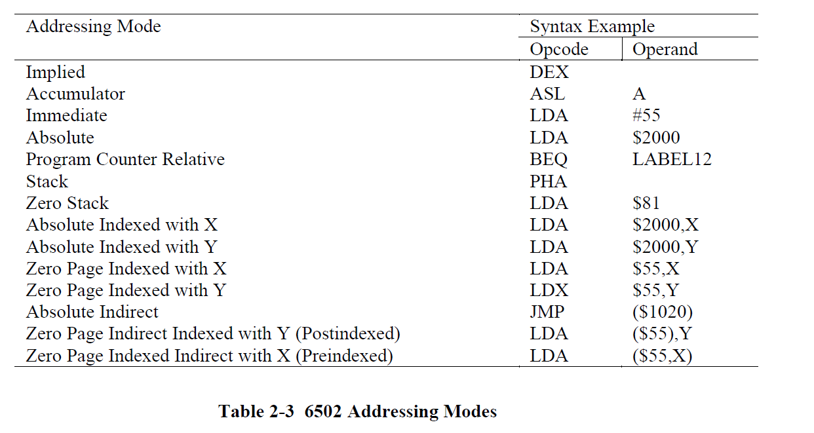

# What Does an Emulator Need?

An emulator will need some components that virtualizes the physical hardware. Here are some things off the top of my mind:

1. CPU
2. Memory
3. Input/Output
4. Audio
5. Video

The CPU and Memory are the easiest to abstract into virtual components, so that will be implemented first. I/O, Audio, and Video emulation are much more difficult and will be pieces that should be only started once the CPU is confirmed to be working.

## Learning Materials

I really enjoy reading Marat Fayuzullin's guide on the topic in how to write an emulator. You can find it here:

* [How To Write a Computer Emulator](https://fms.komkon.org/EMUL8/HOWTO.html)
    * https://fms.komkon.org/EMUL8/HOWTO.html

Fun fact, Marat was the one who originally came up with the `.nes` file format for ROMs, and is the author of **iNES**.

## A Good Start

### Endian 

The NES is a little-endian machine. That means the lowest byte is fetched first in the 16 bit address.

### Memory

To build some confidence in coding. We can build a basic memory class to contain 64 KB of data. This is the total addressable memory for an 8-bit system like the NES.

Let's about memory mapping later. The best way to represent a bunch of consecutive memory addresses is -- you've guessed it -- by using an array!

Our memory class will have a preinitialized array of 2^16-1, or 65535 numbers that will contain `0`. The API can be simple, a consstructor, along with `get` and `set` methods to be able to access and mutate the memory data without peeking directly into the array.

```
const MaxAddress = 0x10000;

export class Memory {
    private _memory: number[];

    constructor() {
        this._memory = [];

        for (let i = 0; i < MaxAddress; i++) {
            this._memory.push(0);
        }
    }

    public set(address: number, value: number) {
        const cleanedAddress = Memory._cleanAddress(address);
        const cleanedValue = Memory._cleanValue(value);

        this._memory[cleanedAddress] = cleanedValue;
    }

    public get(address: number) {
        const cleanedAddress = Memory._cleanAddress(address);

        return this._memory[cleanedAddress];
    }

    private static _cleanAddress(address: number) {
        return address & 0xFFFF;
    }

    private static _cleanValue(value: number) {
        return value & 0xFF;
    }
}
```

> **Important**. To prevent setting a memory address that is out of bounds, it's important to always restrict the input address to a range from 0 to 0xFFFF. For that, a bitwise AND can be performed. Do the same for values too... which in this case for the NES, 8 bit numbers. So bitwise AND with 0xFF.

### Memory Unit Tests

Quickly let's write a basic unit test to see if the current memory implementation works as expected. This is also a chance to continually improve the inner-dev loop. `jest` is usually my test framework of choice when it comes to JS unit testing.

```
import { Memory } from "./memory";

describe('Memory tests', () => {
    it('should initialize correctly', () => {
        const memory = new Memory();

        for (let i = 0; i < 0x10000; i++) {
            expect(memory.get(i)).toBe(0);
        }
    });

    it('should set and get value correctly', () => {
        const memory = new Memory();

        const address = 0xAB;
        const expectedValue = 98;

        memory.set(address, expectedValue);

        expect(memory.get(address)).toBe(expectedValue);
    });

    it('should wrap address and set value correctly', () => {
        const memory = new Memory();

        const address = 0x10011;
        const expectedAddress = 0x11;
        const expectedValue = 95;

        memory.set(address, expectedValue);

        expect(memory.get(expectedAddress)).toBe(expectedValue);
    });

    it('should only set 8 bits for the value', () => {
        const memory = new Memory();

        const address = 0x123;
        const value = 0x199;
        const expectedValue = 0x99;

        memory.set(address, value);
        
        expect(memory.get(address)).toBe(expectedValue);
    });
});
```

From here on, I can trust that the basic operations of the `Memory` object works correctly. Any time I add new features to the `Memory` class, I should think about updating the unit tests to maintain the trust.

### CPU

The CPU of the NES is a Ricoh 2A03 CPU. The 2A03 is based on the famous MOS 6502 CPU, and runs at about 1.79 MHz for NTSC systems. As far as documentation goes, this is probably the most document piece of the NES. If direct documentation about the 2A03 cannot be found, pretty much any 6502 documentation can be easily acquired since it was one of the most popular CPUs in the 1980s. Really, the only difference from a 2A03 and the typical 6502 is lack of binary-coded decimal mode (BCD).

So far, the best book I've found relating to the topic of 6502 architecture has been **Programming the 65816. Including the 6502, 65C02 and 65802**. It has all the details needed to implement each instruction along with the specific cycle counts.

If you have browsed the internet like I have, looking at the experiences of others programming an NES emulator, you will find the topic of implementing unofficial opcodes coming up quite frequently. The question is, do we actually need to implement them?

Surprisingly, you can get away with running quite a number of games without implementing them. So it is up to you in how much compatibility you want with the emulator. For this project, the goal will be to implement the unsupported opcodes.

### Fetch, Decode, Execute, Store

That's pretty much the pattern to a CPU. It just does this over, and over again.

The NES has an 8-bit data bus. Therefore, it can only work with 1 single byte at a time.

It can be expressed with pseudo-code that looks like this:
```
while(running) {
    const addr = memory.read(pc);
    const op = fetch(addr);
    const opContext = decode(op);
    const result = execute(opContext);
    store(opContext, result);
}
```

This type of loop is very typical in emulator development.

### Test

Testing an emulated CPU implementation is tough! Thankfully, since the NES is such a widely emulated system, there are existing tests out there which can validate the CPU core.

A lot of them can be found here: http://wiki.nesdev.com/w/index.php/Emulator_tests

The first I really like to use to actually get some sense of a correct implementation is the infamous `nestest.log`.

https://www.qmtpro.com/~nes/misc/nestest.log

All one needs to do is download the `nestest.rom` found here: http://nickmass.com/images/nestest.nes

Load the ROM bits into memory at address `0xC000` and beging executing your CPU. The implemenation of your CPU should output the same log entries as `nestest.log`, and if it does, then you may have a pretty reliable CPU!

To see if there were any errors in the test, memory addresses `0x02`, and `0x03` can be inspected for the error codes and can be cross referenced in this document: https://www.qmtpro.com/~nes/misc/nestest.txt. The document notes that the results stored in these memory locations are reference to the **LAST** test that had  failed. 

The goal is to to get `0x02` to read `0x00`. :)

### Basic CPU Implementation

#### Registers

Some CPUs provide a lot of registers to store temporary data while executing instructions. For the 6502, there are only a few regiseters, and most storage of data during instruction execution happens in memory.

THere are different types of addressing modes the 6502 has access memory and store/read temporary results. This effectively gives the 6502 the entire memory space and consequently "many registers".


The CPU has registers:

|Register|Description|Width (bits)|
|--------|-----------|-----|
|A|Accumulator - Generally holds the value for an instruction|8|
|X, Y|These registers will often be used for forming memory addresses to access, and other temporary values.|8|
|P|Processor status register. 8 fields in this register each field being 1 bit which indicate various conditions within the processor.|8|
|S|Stack pointer. Self explanatory.|8|
|PC|Program counter. Stores the current memory location to be executed **NEXT**.|16|


* Taken from the WDC Programming the 65816 book.

Wow just only 6 registers total!

Now this can be represented by this simple interface here:

```
interface ICpuRegisters {
    A: number;
    X: number;
    Y: number;
    P: number;
    S: number;
    PC: number;
}
```

And for a good start, the CPU can already have an implementation:

```
export default class Cpu {
    private _cpuRegisters: ICpuRegisters;

    constructor() {
        this._cpuRegisters = {
            A: 0,
            X: 0,
            Y: 0,
            P: 0,
            S: 0,
            PC: 0
        };
    }

    private get A() {
        return this._cpuRegisters.A;
    }

    private get X() {
        return this._cpuRegisters.X;
    }

    private get Y() {
        return this._cpuRegisters.Y;
    }

    private get P() {
        return this._cpuRegisters.P;
    }

    private get S() {
        return this._cpuRegisters.S;
    }

    private get PC() {
        return this._cpuRegisters.PC;
    }

    private set A(value: number) {
        this._cpuRegisters.A = value & 0xFF;
    }

    private set X(value: number) {
        this._cpuRegisters.X = value & 0xFF;
    }

    private set Y(value: number) {
        this._cpuRegisters.Y = value & 0xFF;
    }

    private set P(value: number) {
        this._cpuRegisters.P = value & 0xFF;
    }

    private set S(value: number) {
        this._cpuRegisters.S = value & 0xFF;
    }

    private set PC(value: number) {
        this._cpuRegisters.PC = value & 0xFFFF;
    }
}
```

As a quick note -- always try to do the conversion in ensuring registers store the values in their appropriate width when performing a `write` operation. These types of operations occur less frequently than `read` operations and because of this, will impact performance less.

The A, X and Y registers are simple registers that just store numbers. 

For the status register, there are 7 defined fields within the 8 possible bits in this register. An `enum` is a good way to keep a reference of the specific bit positions of the status register:

```
enum CpuStatusBitPositions {
    Carry = 0,
    Zero = 1,
    IrqDisable = 2,
    DecimalMode = 3,
    BrkCausesIrq = 4,
    UnusedBit5 = 5,
    Overflow = 6,
    Negative = 7
};
```

Then a few helpers can be created to directly manipulate on the status register for the CPU. It will be very convenient to set and clear the status fields with these:

```
private _setStatus(field: CpuStatusBitPositions) {
    this.P |= (1 << field);
}

private _clearStatus(field: CpuStatusBitPositions) {
    this.P &= ~(1 << field);
}

private _isStatusFieldSet(field: CpuStatusBitPositions) {
    return (this.P & (1 << field)) > 0;
}
```

Then the intention is to use these methods like this:

```
// Sets the ZERO flag
this._setStatus(CpuStatusBitPositions.Zero);

....


// Clears the ZERO flag
this._clearStatus(CpuStatusBitPositions.Zero);
```

#### Stack

The stack is 256 bytes long and ranges in memory from `0x100` to `0x1FF`. The processor `S` register then stores the current location in memory, the current location of the stack pointer.

The stack pointer will GROW downwards. That is, `0x1FF` is the **first address** and subsequent pushes will **decrement** this address. Pulling data from the stack will **increment** this address.

When the stack is pushed:

1. Push data to the current address in memory signified by the S pointer. 
2. Decrement the S pointer.

When the stack is pulled:

1. Increment the S pointer.
2. Return the data found in memory indicated by this pointer.

Note that the verbiage here is "pulled" and not "pop". When pulling (reading) data by the stack pointer, the value will still exist, but will be overwritten on the next stack push.

If the stack is only 8 bits, then we will also have to use a mask of `0x100` during memory operations to get the **real** address in memory indicated by the stack pointer.

```
private _stackPush(data: number) {
    this._memory.set(0x100 | this.S, data);
    this.S--;
}

private _stackPull() {
    this.S++;
    return this._memory.get(0x100 | this.S);
}
```

> **Important**. Only the A and P register can be pushed onto and pulled from the stack.

#### Program Counter

The program counter can store a range of `0x0000` to `0xFFFF`. Therefore it is 16 bits wide, and incrementing past `0xFFFF` will wrap itself to `0x0000`.

There are 255 opcodes.

Each instruction fetched will contain an opcode. The opcode will determine whether the instruction is 0, 1 or 2 bytes long.

The length of the instruction is how much to increment the Program Counter.

The opcodes each will have a definite length if they are used within an instruction.

For example, one of the variants of `ORA` opcode will be 2 bytes in length. Which means to increment the program counter by 2 if the opcode is read.

Pretending that we have an instruction size table called `InstructionSizes`, a typical fetch from memory into the program counter would look like this:

```
const op = this._memory.get(this.PC);

// acquire the operands here

this.PC += InstructionSizes[op];
```

Refer to **Programming the 65816** for the specific number of bytes each instruction has for an opcode.

#### Addressing Modes

The power of the 6502 comes from addressing modes. There are 14 of them. Passing an input address into an addressing mode will give the effective address on where the operand is in memory. 

The different kinds of addressing modes:

1. Implied
2. Accumulator
3. Immediate
4. Absolute
5. Program Counter Relative
6. Stack
7. Zero Stack
8. Absolute Indexed with X
9. Absolute Indexed with Y
10. Zero Page Indexed with X
11. Zero Page Indexed with Y
12. Absolute Indirect
13. Zero Page Indirect Indexed with Y (Post Indexed)
14. Zero Page Indexed Indirect with X (Pre Indexed)



#### What is Zero-Paged Memory?

Any **page** of memory in the 6502 architecture is considered to be 256 bytes long. That means "zero page" is the first page in memory (0-indexed). This makes zero page have a range of `0x0000` to `0x00FF`. **Zero page addressing** is just a more convenient absolute addressing where it only refers to the first 256 bytes in memory. Instead of **absolute addressing** where 2 bytes are needed to represent an address, **zero page addressing** only needs 1. This results in less latency (clock cycles) when used.

> **Important**. Sometimes the term "Direct Page" is used interchangeably with Zero Page.

#### Indexing

For the addressing modes involving indexing, the simple ones just take some base address, and adds the offset specified in the X, and Y registers to obtain the effective address. These are:

* Absolute Indexed with X
* Absolute Indexed with Y
* Zero Page Indexed with X
* Zero Page Indexed with Y

The more complicated ones are called "indirect" indexing. Basically, given some base address and offset, we can go to that "indirect address", and within that "indirect address" contains the values needed to build the "effective address". That is, the effective addresses are stored in some location in memory, and must be read.

As for the difference in **postindexed** and **preindexed** addressing... Think of it this way: 

* postindexed - Get the indirect address, then go find the effective address. Add the index to that effective address.
* preindexed - Get the indirect address, add the index to that indirect address and find the effective address


#### Instructions

There are 56 different types operations which can be performed. Taking into consideration that each operation can take on different forms based on addressing modes, there can be 151 different instructions (opcodes) which the 6502 can execute.

Each instruction has two specific properties:

1. A fixed number of cycles it will take to complete
2. The byte length it occupies in memory

Again, we are lucky here in that this information is available and fixed, making 6502 pretty easy emulate when it comes to instruction timing.

Implementing an instruction in the CPU is just writing the necessary code to achieve the desired result.

#### Bugs

Known bug is that if indirect addressing is used with a jump instruction where the address ends in `0xFF`, what **SHOULD** happen is that the PC will get the new low byte at `0x20FF`, but the new high byte at `0x2100`. However, what actually happens is that there is a fail to carry and the addresses which bytes are fetched are at `0x20FF` and then `0x2000`.

For the emulator, this type of behavior **must be considered** during implementation if wanting accuracy to the hardware.

The two utility methods are implemented to perform a standard 16-bit address read and a 16-bit address read with this specific but:

```
function read16(memory: Memory, address: number) {
    const lo = memory.get(address);
    const hi = memory.get(address + 1);

    return ((hi << 8) | lo) & 0xFFFF;
}

function read16Bug(memory: Memory, address: number) {
    const a = address;

    const bHi = a & 0xFF00;
    const bLo = (a + 1) & 0xFF;
    const b = bHi | bLo;

    const effLo = memory.get(a);
    const effHi = memory.get(b);

    const effAddress = ((effHi << 8) | effLo) & 0xFFFF;

    return effAddress;
}
```

## Input/Output, Audio, Video

TODO.